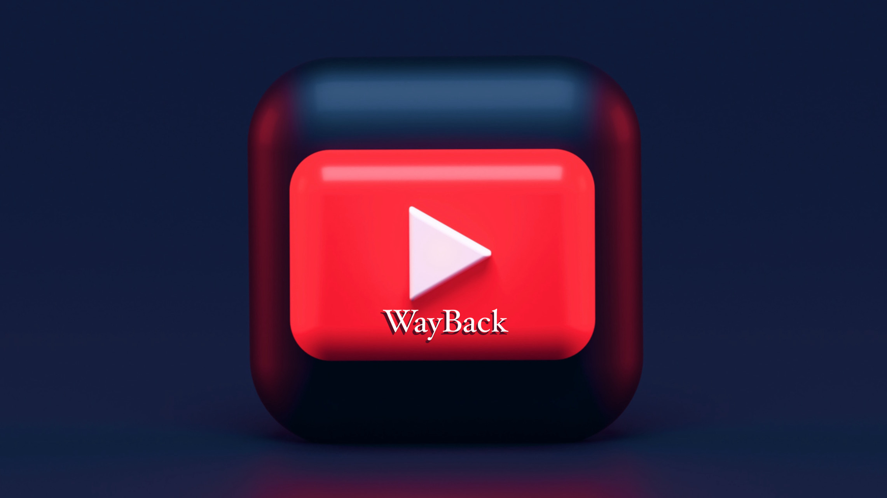

<p align="center">
  
</p>

<br/>

<p align="center">
  <a href="https://docflex.notion.site/WayBack-The-YouTube-Time-Machine-f3fb31e58227406ea403e3932f4ba352?pvs=4">
        
  </a>
  <a href="https://in.linkedin.com/in/r0m" target="_blank">
    
  </a>
  <a href="https://choosealicense.com/licenses/mit/" target="_blank">
    
  </a>

</p>

## 📋 Project Overview
🌐 Introducing WayBack: Your Gateway to the Latest YouTube Videos 🚀

In a digital era flooded with video content, WayBack stands as a solution to streamline your YouTube video discovery experience. Designed to offer the freshest videos based on your interests, it provides a user-friendly API that fetches and presents videos in reverse chronological order. 🎥🔍 Our mission is to offer you a seamless way to explore the latest video content while ensuring scalability and optimization. 🚀

Embark on a journey of discovery with WayBack! Dive into the world of YouTube videos like never before. 🌟📺
## 🔑 Key Features

* 🕵️‍♂️ Intelligent Video Fetching: WayBack's API continuously retrieves the latest YouTube videos based on your chosen tag/search query, ensuring you never miss out on new content. ⏰🔎

* 📅 Reverse Chronological Sorting: Videos are displayed in reverse chronological order of their publishing date-time, offering you the most recent content first. 📆🔁

* 🎬 Rich Video Metadata: The API collects essential video data such as title, description, publishing datetime, thumbnail URLs, and more, enhancing your viewing experience. 📝🖼️

* 🚀 Scalability and Performance: WayBack's architecture is designed for scalability and optimization, guaranteeing a smooth experience as the user base grows. ⚙️📈

## 🔌 Technology Stack
* Django REST Framework: WayBack is built on top of the powerful Django framework, augmented with the REST Framework to create a robust API-driven application. 🐍🌐

* SQLite Database: The SQLite relational database ensures data integrity while handling video storage and retrieval efficiently. 🗃️🔒

* Dockerization: WayBack is Dockerized, allowing for easy deployment and management, ensuring consistency across different environments. 🐳🚀

* Python Requests Library: The Python Requests library facilitates API calls to retrieve YouTube video data seamlessly. 📡🔗

* RESTful API: WayBack's API follows RESTful principles, offering a well-structured and user-friendly interface for video retrieval. 🔌📄

Discover a new way to explore YouTube videos with WayBack! Unveil the latest content and dive into a world of seamless video discovery. 🌟🎥🔍


<h2 align="center"><b>🛠️ Technologies Used</b></h2>

<br>
    <p align="center">
        
        
        
        
        
    </p>
<br/>

## 🏃‍♂️Running The Project

Dive into the exciting world of WayBack's DevLog! 🚀 Embark on a journey through the creation of a cutting-edge API for fetching YouTube videos and relive the process from inception to reality. Join us as we delve into the challenges, triumphs, and pivotal moments that define the development process. Don't miss out on this captivating narrative – explore the DevLog now and stay tuned for intriguing updates! 📖🌟 [WayBack's DevLog](https://docflex.notion.site/WayBack-The-YouTube-Time-Machine-f3fb31e58227406ea403e3932f4ba352?pvs=4)


### Step 1: Cloning the Repository 📥 

```
git clone https://github.com/docflex/way-back
```

### Step 2: Creating a Virtual Environment 🌐

The reason why we do this is explained in the DevLog Mentioned Above. Please Check it out for a Deeper Dive into this Project.

```
python3 -m venv venv
```

Next, You will be needing to switch to the Virtual Environment. To do so, Run:
```
source venv/bin/activate
```

### Step 3: Installing the Dependencies 📦

```
pip install -r backend/requirements.txt
```

### Step 4: Fixing Environment Variables 🔧

```
cp env.template .env
```

### Step 5: Make Migrations 🗂️

```
cd backend

python3 manage.py makemigrations

python3 manage.py migrate
```

### Step 6: Run Server 🚀

```
python3 manage.py runserver     
```

### Step 7: Test Endpoints 🧪

Testing the `videos` Endpoint:
```
curl http://127.0.0.1:8000/videos/
```

### Step 8: Checking Database 🗃️


Open the Shell to Interact with the Database
```
python3 manage.py shell
```

To query all the data in the database run:
```
from youtubeScrapper.models import YouTubeVideo

# Fetch all YouTube videos from the database
videos = YouTubeVideo.objects.all()

# Print selected attributes of each video
for video in videos:
    print(f"Video ID: {video.video_id}")
    print(f"Title: {video.title}")
    # Print other attributes as needed
    print("\n")  # Add a newline for separation
```

### Step 9: Running Persistent Periodic Fetching

```
python3 persistFetch.py
```